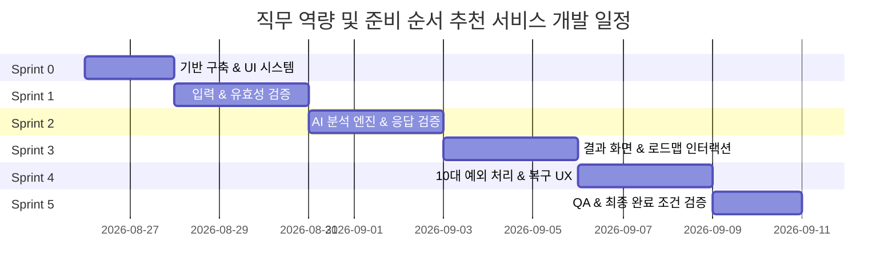

# 📋 직무 역량 및 준비 순서 추천 서비스 개발 계획서 (Sprint Plan)

> **문서 버전:** 1.1.0 (최종 완료)  
> **기준 문서:** [PRD.md](file:///c:/job/PRD.md)  
> **관리 위치:** `docs/DEVELOPMENT_PLAN.md`  
> **진행 상태:** ✅ **Sprint 0 ~ Sprint 5 전체 완료 (2026-08-27)**  
> **프로젝트 목표:** 취업 준비생이 전공, 희망 직무, 현재 준비 상황을 입력하면 AI가 핵심 역량, 부족한 역량, 단계별 준비 순서(1단계→2단계→3단계) 및 구체적 실행 방안을 20초 이내에 추천하는 웹 애플리케이션 개발

---

## 📌 목차
1. [프로젝트 개요 및 기본 원칙](#1-프로젝트-개요-및-기본-원칙)
2. [기술 스택 및 아키텍처 구조](#2-기술-스택-및-아키텍처-구조)
3. [전체 스프린트 로드맵 요약](#3-전체-스프린트-로드맵-요약)
4. [스프린트별 상세 개발 계획](#4-스프린트별-상세-개발-계획)
   - [Sprint 0: 프로젝트 기반 구축 및 기본 UI 시스템](#sprint-0-프로젝트-기반-구축-및-기본-ui-시스템)
   - [Sprint 1: 입력 및 유효성 검증 & 확인 단계 구현](#sprint-1-입력-및-유효성-검증--확인-단계-구현)
   - [Sprint 2: AI 분석 엔진 및 응답 데이터 검증 파이프라인](#sprint-2-ai-분석-엔진-및-응답-데이터-검증-파이프라인)
   - [Sprint 3: 결과 화면 및 단계별 준비 로드맵 인터랙션](#sprint-3-결과-화면-및-단계별-준비-로드맵-인터랙션)
   - [Sprint 4: 10대 예외 처리 및 복구 UX 완성](#sprint-4-10대-예외-처리-및-복구-ux-완성)
   - [Sprint 5: 종합 QA, 성능 검증 및 PRD 완료 조건 검증](#sprint-5-종합-qa-성능-검증-및-prd-완료-조건-검증)
5. [PRD 요구사항 추적 매트릭스 (RTM)](#5-prd-요구사항-추적-매트릭스-rtm)
6. [예외 처리(5.1~5.10) 대응 명세](#6-예외-처리51510-대응-명세)
7. [범위 외 항목 (Out of Scope) 준수 관리](#7-범위-외-항목-out-of-scope-준수-관리)

---

## 1. 프로젝트 개요 및 기본 원칙

### 1.1 핵심 가치
- **명확성(Clarity):** 나열식 정보가 아닌, 1단계 → 2단계 → 3단계의 구체적 실행 순서 제공
- **신뢰성(Reliability):** AI 분석 실패 및 예외 상황에서도 사용자가 입력한 데이터는 절대 유실되지 않음
- **경량성(Simplicity):** 로그인, DB, 결제 없이 즉각적인 가치 전달에 집중

### 1.2 핵심 성공 지표 (PRD 1장 기준)
- [x] 입력 완료 후 **20초 이내** 결과 노출
- [x] 핵심 역량 **5~7개 내외** 제공
- [x] 추천 준비 항목 **최소 3개 이상** 및 단계별 우선순위/이유/방법/다음행동 제공
- [x] 오류 시 입력 데이터 유지 및 재분석 보장

---

## 2. 기술 스택 및 아키텍처 구조

### 2.1 기술 스택
- **Core Framework:** Next.js 14+ (App Router), React 18+, TypeScript
- **Styling:** Tailwind CSS, Lucide React (Icons), Shadcn/UI 기반 커스텀 컴포넌트
- **State Management:** React Component State / Custom Hook 기반 가벼운 클라이언트 상태 관리 (DB 없음)

### 2.2 디렉터리 구조 설계
```text
c:\job/
├── PRD.md                     # 서비스 요구사항 명세서
├── docs/                      # 개발 계획 및 운영 문서
│   └── DEVELOPMENT_PLAN.md   # 본 개발 계획서
├── app/
│   ├── layout.tsx             # 루트 레이아웃 (SEO, 메타데이터, 폰트)
│   ├── globals.css            # 글로벌 스타일 및 테마 토큰
│   └── page.tsx               # 메인 페이지 및 단계(Stage) 오케스트레이션
├── components/
│   ├── prep/                  # 직무 추천 서비스 도메인 전용 컴포넌트
│   │   ├── app-header.tsx               # 상단 네비게이션 헤더
│   │   ├── stage-progress.tsx           # 진행 단계 인디케이터
│   │   ├── input-step.tsx               # Step 1: 입력 폼
│   │   ├── confirm-step.tsx             # Step 2: 입력 확인 뷰
│   │   ├── loading-step.tsx             # Step 3: 분석 중 상태 (20초 타임아웃)
│   │   ├── result-step.tsx              # Step 4: 종합 분석 결과 뷰
│   │   ├── skill-card.tsx               # 핵심/부족 역량 카드
│   │   ├── recommendation-step-card.tsx # 단계별 준비 항목 카드 (1~3단계)
│   │   ├── readiness-badge.tsx          # 준비도 상태 배지
│   │   ├── section-header.tsx           # 섹션 타이틀 공통 컴포넌트
│   │   ├── error-state.tsx              # 예외 상황별 복구 화면
│   │   └── scenario-preview.tsx         # 예외 시나리오 테스트용 툴바 (개발/검증용)
│   └── ui/                    # 공통 UI 원자 컴포넌트 (Button, Card, Input 등)
└── lib/
    ├── utils.ts               # 공통 유틸리티 (cn 등)
    ├── validation.ts          # 입력값 및 글자 수 검증 로직
    └── mock-analysis.ts       # AI 분석 생성 엔진, 결과 검증기, Mock 데이터
```

---

## 3. 전체 스프린트 로드맵 요약



| 스프린트 | 목표 | 주요 산출물 | 예상 기간 |
|---|---|---|---|
| **Sprint 0** | 기반 구축 및 디자인 시스템 토큰화 | 기본 레이아웃, 공통 UI 컴포넌트, 전역 테마 | 1~2일 |
| **Sprint 1** | 입력 폼 및 실시간 유효성 검증, 확인 뷰 | `InputStep`, `ConfirmStep`, `validation.ts` | 2~3일 |
| **Sprint 2** | AI 분석 엔진 및 응답 데이터 검증기 | `mock-analysis.ts`, 스키마 검증기, 타임아웃 제어 | 2~3일 |
| **Sprint 3** | 결과 리포트 및 단계별 준비 로드맵 | `ResultStep`, `SkillCard`, `RecommendationStepCard` | 2~3일 |
| **Sprint 4** | 10대 예외 처리 및 입력 데이터 보존 복구 UX | `ErrorState`, 시나리오 스위처, 방어 로직 | 2~3일 |
| **Sprint 5** | 통합 테스트, E2E 검증, 성능 및 PRD 완료 조건 점검 | QA 체크리스트, 배포 준비, 문서 최종화 | 1~2일 |

---

## 4. 스프린트별 상세 개발 계획

### Sprint 0: 프로젝트 기반 구축 및 기본 UI 시스템
- **목표:** PRD에 명시된 4단계 화면 흐름을 수용할 수 있는 기반 레이아웃과 디자인 시스템을 구성한다.
- **관련 PRD 섹션:** `3.1 화면 구성`, `4.6 데이터 처리 범위`
- **주요 작업:**
  1. [x] Next.js 14 기반 앱 구조 및 폰트/스타일 토큰 설정 (`app/globals.css`, `app/layout.tsx`)
  2. [x] 기본 UI 컴포넌트 구성 (`components/ui/*`: Button, Card, Input, Textarea, Badge 등)
  3. [x] 상단 헤더 및 진행 상태 바 (`components/prep/app-header.tsx`, `components/prep/stage-progress.tsx`)
  4. [x] 화면 전환 상태 머신 정의 (`input` → `confirm` → `loading` → `result` / `error`)
- **완료 조건 (DoD):**
  - 반응형(모바일, 태블릿, 데스크톱) 레이아웃 기본 골격이 깨짐 없이 렌더링됨
  - 외부 DB 및 로그인 의존성 없이 순수 클라이언트 상태로 화면 전환이 가능함

---

### Sprint 1: 입력 및 유효성 검증 & 확인 단계 구현
- **목표:** 전공, 희망 직무, 준비 상황을 입력받고 글자 수 및 필수 입력 조건을 실시간 검증하는 기능 구현
- **관련 PRD 섹션:** `3.2 입력 화면`, `3.3 준비 상황 확인 화면`, `4.1 사용자 입력`, `4.2 입력값 검증`, `5.1~5.3 예외 처리`
- **주요 작업:**
  1. [x] **입력 필드 컴포넌트 구현 ([components/prep/input-step.tsx](file:///c:/job/components/prep/input-step.tsx))**
     - 전공: 1줄 텍스트 입력 (`2~50자`), 플레이스홀더: `전공을 입력하세요`
     - 희망 직무: 1줄 텍스트 입력 (`2~50자`), 플레이스홀더: `희망 직무를 입력하세요`
     - 현재 준비 상황: 여러 줄 텍스트 입력 (`2~1,000자`), 플레이스홀더: `현재까지 준비한 내용을 입력하세요 (준비한 내용이 없다면 '없음' 입력)`
     - 예시 데이터 불러오기 기능 (`handleFillExample`) 제공
  2. [x] **검증 엔진 구현 ([lib/validation.ts](file:///c:/job/lib/validation.ts))**
     - 빈 값 체크: `필수 정보를 입력해주세요. (준비된 내용이 없다면 "없음"으로 입력해주세요)`
     - 최소 글자 수 미달: `전공과 희망 직무는 2자 이상, 준비 상황은 2자 이상 입력해주세요. (준비한 내용이 없다면 "없음" 입력)`
     - 최대 글자 수 초과: `전공과 희망 직무는 50자 이내, 준비 상황은 1,000자 이내로 입력해주세요.`
     - 실시간 글자 수 카운터 (예: `45/50자`, `320/1,000자`) 및 에러 발생 필드 하이라이트
  3. [x] **준비 상황 확인 컴포넌트 ([components/prep/confirm-step.tsx](file:///c:/job/components/prep/confirm-step.tsx))**
     - 사용자가 입력한 전공/직무/준비상황을 카드 형태로 명확히 요약 표시
     - `수정하기` 클릭 시 입력값 그대로 유지하며 `input` 화면 복귀
     - `분석 시작` 클릭 시 검증 후 `loading` 단계 진입
- **완료 조건 (DoD):**
  - 유효하지 않은 입력 상태에서 `분석 시작`이 불가능하며 정확한 에러 메시지가 표기됨
  - `수정하기`를 눌러도 기존 입력 텍스트가 100% 유지됨

---

### Sprint 2: AI 분석 엔진 및 응답 데이터 검증 파이프라인
- **목표:** 사용자 입력을 바탕으로 직무 맞춤형 분석을 생성하고, PRD에 규정된 스키마 조건 충족 여부를 엄격히 검증
- **관련 PRD 섹션:** `3.4 분석 중 화면`, `4.3 AI 분석`, `4.4 결과 검증`, `4.5 로딩 및 재시도`, `5.4~5.7 예외 처리`
- **주요 작업:**
  1. [x] **로딩 상태 컴포넌트 구현 ([components/prep/loading-step.tsx](file:///c:/job/components/prep/loading-step.tsx))**
     - 단계적 로딩 안내 문구 순차 전환:
       1) `현재 준비 상황을 분석하고 있어요.`
       2) `직무에 필요한 역량과 준비 순서를 정리하고 있어요.`
       3) `맞춤형 단계별 로드맵을 구성하고 있어요.`
     - 진행 게이지 애니메이션 및 중복 요청 방지 버튼 잠금
  2. [x] **AI 분석 로직 및 Mock 엔진 개발 ([lib/mock-analysis.ts](file:///c:/job/lib/mock-analysis.ts))**
     - 직무별(프론트엔드, 백엔드, 데이터 분석, 서비스 기획 등) 도메인 특화 데이터 생성기
     - **핵심 역량 5~7개** 생성 규칙 준수
     - **부족한 역량 및 판단 이유** 생성
     - **추천 준비 항목 최소 3개 이상** (단계, 우선순위, 추천 이유, 준비 방법, 다음 행동) 생성
  3. [x] **결과 유효성 검증기 (Result Validator - `validateAnalysisResult`)**
     - 응답 내 핵심 역량 개수(5~7개), 부족 역량 여부, 추천 항목(≥3개), 준비 방법/다음 행동 누락 여부 검사
     - 검증 실패 시 불완전한 결과 표출을 차단하고 `format_error` 또는 `insufficient` 에러 트리거
  4. [x] **20초 타임아웃 방어 로직 (`AbortController` / 타이머)**
     - 20초 초과 시 무한 로딩을 즉시 중단하고 타임아웃 안내 화면 표시
- **완료 조건 (DoD):**
  - 정상 응답 시 20초 이내에 완전한 데이터 구조가 반환됨
  - 불완전한 데이터(항목 2개 이하, 필수 필드 누락)가 들어올 경우 렌더링을 차단하고 복구 단계로 전이됨

---

### Sprint 3: 결과 화면 및 단계별 준비 로드맵 인터랙션
- **목표:** 분석 결과를 시각적으로 매력적이고 직관적인 4대 영역으로 렌더링하고, 단계별 순서(1→2→3단계) 확인 경험 완성
- **관련 PRD 섹션:** `3.5 결과 화면`, `사용자 스토리 1~4`
- **주요 작업:**
  1. [x] **종합 결과 뷰 구현 ([components/prep/result-step.tsx](file:///c:/job/components/prep/result-step.tsx))**
     - 상단: 사용자 입력 요약 배너 및 직무 준비도 종합 스코어 배지
     - 4대 영역 순차 배치:
       - **① 핵심 역량 (5~7개):** 역량 명칭, 카테고리 태그, 핵심 설명 (`SkillCard`)
       - **② 부족한 역량:** 보완 필요 역량 및 부족 판단 사유 콜아웃
       - **③ 추천 준비 항목 (3개 이상):** `1단계 → 2단계 → 3단계` 타임라인 로드맵 (`RecommendationStepCard`)
       - **④ 다시 분석하기 버튼 영역**
  2. [x] **단계별 추천 항목 카드 컴포넌트 ([components/prep/recommendation-step-card.tsx](file:///c:/job/components/prep/recommendation-step-card.tsx))**
     - 단계 배지 (1단계, 2단계, 3단계) 및 우선순위 강조
     - 준비 항목명 및 추천 이유 (Why)
     - 구체적인 준비 방법 (How)
     - 즉각 실행할 수 있는 다음 행동 체크리스트 (Action Item)
  3. [x] **재분석 플로우 (`다시 분석하기`)**
     - 기존 입력값(전공, 직무, 상황)을 100% 보존한 상태로 재요청
     - 신규 분석 성공 시 이전 결과를 원활하게 교체
- **완료 조건 (DoD):**
  - 핵심 역량 5~7개가 규격에 맞게 렌더링됨
  - 추천 준비 항목이 1단계 → 2단계 → 3단계 순서대로 시각화되며 우선순위/이유/방법/다음행동이 모두 표시됨

---

### Sprint 4: 10대 예외 처리 및 복구 UX 완성
- **목표:** PRD 5장에 명시된 모든 예외 상황에 대한 명확한 에러 안내 및 데이터 보존 기반의 복구 기능 구현
- **관련 PRD 섹션:** `5.1 ~ 5.11 예외 처리 공통 원칙`
- **주요 작업:**
  1. [x] **상황별 에러 상태 컴포넌트 ([components/prep/error-state.tsx](file:///c:/job/components/prep/error-state.tsx))**
     - 에러 유형별 맞춤 아이콘, 안내 문구, 직관적인 복구 버튼(`다시 시도`, `입력 수정하기`, `다시 분석하기`)
  2. [x] **10대 예외 케이스 완벽 구현 및 매핑:**
     - `5.1 필수 입력 누락` → 인라인 에러 표시, 입력값 유지
     - `5.2 짧은 입력` → 최소 글자 수 가이드 제공
     - `5.3 긴 입력` → 최대 글자 수 가이드 제공
     - `5.4 AI 요청 실패` → 로딩 종료, 전체 화면 유지, `다시 시도` 제공
     - `5.5 20초 타임아웃` → 무한 로딩 방지, `분석에 시간이 오래 걸리고 있습니다. 다시 시도해주세요.`
     - `5.6 응답 형식 오류` → 불완전 결과 미표시, `결과를 완성하지 못했습니다. 다시 분석해주세요.`
     - `5.7 추천 항목 3개 미만` → `추천할 준비 항목이 충분하지 않습니다. 다시 분석해주세요.`
     - `5.8 직무 무관 결과` → `입력 수정하기`를 통해 입력 단계로 복귀
     - `5.9 네트워크 오류` → `네트워크 연결을 확인한 후 다시 시도해주세요.`
     - `5.10 중복 요청` → 버튼 `disabled` 및 로딩 중 클릭 이벤트 무효화
  3. [x] **예외 시나리오 검증 툴바 ([components/prep/scenario-preview.tsx](file:///c:/job/components/prep/scenario-preview.tsx))**
     - 개발 및 테스트 시 10대 예외 상황을 즉각 시뮬레이션할 수 있는 컨트롤러 제공
- **완료 조건 (DoD):**
  - 모든 예외 발생 시 화면이 깨지거나 흰 화면(Blank)이 되지 않음
  - 어떤 에러 상황에서도 사용자가 입력한 텍스트가 초기화되지 않음

---

### Sprint 5: 종합 QA, 성능 검증 및 PRD 완료 조건 검증
- **목표:** PRD 6장의 체크리스트 100% 충족 여부 검증 및 모바일 반응형/접근성 최종 점검
- **관련 PRD 섹션:** `6) 완료 조건` (핵심 기능 15개, 예외 처리 10개, 범위 제한 8개)
- **주요 작업:**
  1. [x] **PRD 완료 조건 전수 점검 및 단위/E2E 시나리오 테스트**
  2. [x] **성능 및 반응 속도 점검 (20초 이내 렌더링 확인)**
  3. [x] **크로스 브라우저 & 모바일 반응형 레이아웃 정밀 검수**
  4. [x] **범위 제한 항목(DB/로그인/결제 미구현) 준수 확인**
- **완료 조건 (DoD):**
  - PRD 6장의 모든 체크박스가 충족됨
  - 콘솔 에러(Uncaught Error) 0건 달성

---

## 5. PRD 요구사항 추적 매트릭스 (RTM)

| 요구사항 ID | 요구사항 내용 | 구현 컴포넌트 / 모듈 | 담당 스프린트 | 상태 |
|---|---|---|---|:---:|
| **REQ-01** | 전공, 희망 직무, 준비 상황(여러 줄) 입력 | `input-step.tsx`, `components/ui/*` | Sprint 1 | 완료 |
| **REQ-02** | 글자 수 검증 (전공/직무 2~50자, 준비상황 2~1,000자) | `validation.ts` | Sprint 1 | 완료 |
| **REQ-03** | 준비 상황 확인 및 수정 플로우 | `confirm-step.tsx` | Sprint 1 | 완료 |
| **REQ-04** | 분석 진행 중 로딩 문구 순차 표출 & 중복 요청 방지 | `loading-step.tsx` | Sprint 2 | 완료 |
| **REQ-05** | 20초 이내 AI 분석 결과 생성 및 타임아웃 제어 | `mock-analysis.ts`, `page.tsx` | Sprint 2 | 완료 |
| **REQ-06** | 핵심 역량 5~7개 내외 및 상세 설명 노출 | `result-step.tsx`, `skill-card.tsx` | Sprint 3 | 완료 |
| **REQ-07** | 사용자 부족 역량 및 판단 근거 제시 | `result-step.tsx` | Sprint 3 | 완료 |
| **REQ-08** | 추천 준비 항목 3개 이상 & 1→2→3단계 순서/이유/방법/행동 | `recommendation-step-card.tsx` | Sprint 3 | 완료 |
| **REQ-09** | 기존 입력값 유지 상태로 다시 분석하기 지원 | `result-step.tsx`, `page.tsx` | Sprint 3 | 완료 |
| **REQ-10** | 10대 예외 상황별 복구 메시지 및 입력값 보존 | `error-state.tsx`, `page.tsx` | Sprint 4 | 완료 |
| **REQ-11** | 로그인/결제/DB/외부연동 배제 원칙 준수 | 전 아키텍처 | Sprint 0~5 | 완료 |

---

## 6. 예외 처리(5.1~5.10) 대응 명세

| 항목 | 예외 상황 | 사용자 노출 메시지 | 복구 액션 |
|---|---|---|---|
| **5.1** | 필수값 누락 | `필수 정보를 입력해주세요.` | 해당 필드 하이라이트, 입력값 유지 |
| **5.2** | 최소 글자 수 미달 | `전공과 희망 직무는 2자 이상, 준비 상황은 2자 이상 입력해주세요. (준비한 내용이 없다면 '없음' 입력)` | 실시간 안내, 입력값 유지 |
| **5.3** | 최대 글자 수 초과 | `전공과 희망 직무는 50자 이내, 준비 상황은 1,000자 이내로 입력해주세요.` | 초과 필드 안내, 입력값 유지 |
| **5.4** | AI 서비스 요청 실패 | `분석에 실패했습니다. 잠시 후 다시 시도해주세요.` | `다시 시도` 버튼 제공 |
| **5.5** | 20초 타임아웃 | `분석에 시간이 오래 걸리고 있습니다. 다시 시도해주세요.` | 로딩 종료 후 `다시 시도` |
| **5.6** | AI 응답 형식 오류 | `결과를 완성하지 못했습니다. 다시 분석해주세요.` | 불완전 결과 숨김 후 `다시 분석하기` |
| **5.7** | 추천 항목 3개 미만 | `추천할 준비 항목이 충분하지 않습니다. 다시 분석해주세요.` | 정상 결과 미표시 후 `다시 분석하기` |
| **5.8** | 직무 무관 결과 | `직무에 맞는 분석 결과를 만들지 못했습니다. 희망 직무와 준비 상황을 조금 더 구체적으로 입력한 후 다시 시도해주세요.` | `입력 수정하기`로 복귀 |
| **5.9** | 네트워크 단절 | `네트워크 연결을 확인한 후 다시 시도해주세요.` | `다시 시도` 제공, 입력값 유지 |
| **5.10** | 분석 중 중복 클릭 | 별도 에러 메시지 없음 | 버튼 비활성화 (`disabled`) 처리 |

---

## 7. 범위 외 항목 (Out of Scope) 준수 관리
PRD 4.6 및 6장에 명시된 비포함 기능이 포함되지 않도록 지속적으로 검증합니다.
- ❌ 회원가입 / 로그인 / 소셜 인증
- ❌ 유료 결제 / 구독 모델
- ❌ 데이터베이스(RDB, NoSQL) 연동 및 사용자 정보 영구 저장
- ❌ 실시간 채용 공고 크롤링 및 분석 연동
- ❌ 이력서 / 자기소개서 첨삭 도구
- ❌ 캘린더 연동 및 장기 성장 추적 대시보드
- ❌ 외부 API 종속적 서드파티 서비스
